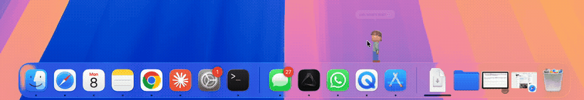
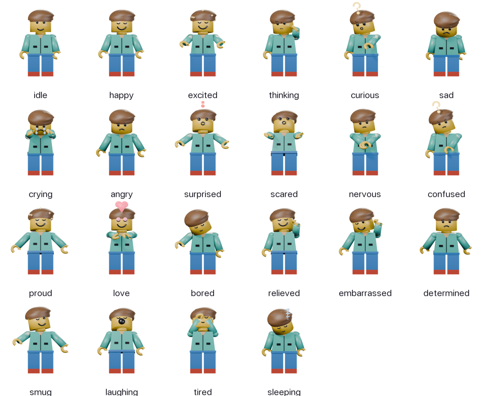

# LilCleo 🫧

**A tiny macOS desktop companion.** **Brick** — a LEGO-style minifigure — lives on
your dock: he strolls around, naps in a corner, and pipes up with a little speech
bubble when something happens on your Mac (CPU spiking, memory filling, battery low,
you've gone quiet…).

The fun part is under the hood: Brick is **modelled, rigged, animated and rendered
entirely in Blender from Python — no external art assets** — and his walk is **real
motion-capture**. The app is dependency-free SwiftUI/AppKit.



> The demo above: he wanders, rests, then his RAM pins the meter, things overheat,
> and he bolts across the screen with his hair on fire. Press **⌃⌥⌘R** to play it.

## Highlights

- 🎭 **22 moods + ~40 actions**, each its own rendered pose — distinct faces (not just
  a recoloured smile), props (coffee, books, a literal fire), and animated cycles.
- 🧠 **Reacts to your actual machine** — native macOS signals (CPU, thermal, battery,
  memory, disk, network, idle, time) drive reactions with friendly, value-aware copy.
- 🚶 **Lives on the dock** — strolls, then quietly naps in a corner; wakes to react,
  then wanders off again. Hugs the Dock's icon strip via the Accessibility API.
- 🔎 **Apple-style picker** — a searchable emoji grid to trigger any mood/action.
- 🧱 **Self-contained 3D pipeline** — `make brick` builds the whole character from
  nothing: mesh → rig → ~60 poses → mocap walk → sprite PNGs.
- 🪶 **Zero third-party dependencies**; ad-hoc-signed `.app` + drag-install `.dmg`,
  with a built-in GitHub-Releases auto-updater.

## The cast — every mood

Each is a real Blender render with its own face and props (note the `?`, `!`, tears,
heart, sparkles):



## Install

Grab **`LilCleo.dmg`** from [Releases](../../releases) (or build it with `make dmg`),
open it, and drag **LilCleo** to **Applications**.

It isn't notarized (no paid Apple Developer ID), so on first launch macOS warns it's
from an unidentified developer — **right-click ▸ Open** once, or:

```sh
xattr -dr com.apple.quarantine /Applications/LilCleo.app
```

> Tip: grant **Accessibility** (System Settings ▸ Privacy & Security ▸ Accessibility)
> so Brick hugs the Dock's icon strip instead of pacing a wider area.

## How Brick is made (the 3D bit, simply)

There are **no image/3D assets in the repo** for the character — Brick is generated
from scratch, headless, every time:

1. **Model + rig in code.** A Python script builds the LEGO-minifig mesh and a small
   7-bone armature (`tools/blender/build_brick.py`), then authors **~60 named poses**
   (happy, panic, coffee, on-fire, …) as bone rotations.
2. **Faces & props** are tiny separate 3D objects (a smile, angry brows, a mug, a
   bulb, flames) toggled per pose — that's why every mood reads differently.
3. **The walk is real motion capture.** A CMU mocap clip is retargeted onto the rig
   and auto-trimmed into a seamless looping gait (`tools/blender/import_bvh.py`).
4. **Render to sprites.** Each pose is rendered to a transparent PNG — front view for
   faces/props, a side-profile cycle for walking/running. The Swift app never touches
   3D; it just **cross-fades and cycles PNGs**, so the renderer and the art are fully
   decoupled (drop in a new folder of PNGs = a new character).

```sh
make brick          # mesh + rig + poses → graft the mocap walk → render every sprite
```

This was built **AI-assisted** — Claude driving Blender headlessly through an MCP —
which is how a from-scratch rigged-and-rendered character came together without a 3D
artist. Deep dive: **[docs/CHARACTER-PIPELINE.md](docs/CHARACTER-PIPELINE.md)**.

## Reacts to your Mac

Walking is the only "nothing happening" state — **everything else is a reaction.**
Brick watches real macOS signals and nudges you with a face, a pose, and a bubble
(toggle **React to system** in the 🫧 menu). All native APIs, no daemons:

| Signal | Brick's reaction |
|---|---|
| Sustained high **CPU** | 🥵 sweating — "CPU's maxing out — 96%" |
| **Thermal** pressure | 🔥 hair on fire — "it's overheating!" |
| **Battery** low / unplugged | 🥱 tired — "battery low — 12% 🔋" |
| **Memory** pressure | 😱 panic — "memory's tight!" |
| Low **disk** | 🌧️ raincloud — "low on disk — 3.4 GB left" |
| **Network** down / back | 🤨 confused / 😌 relieved |
| Long **idle** | 👋 waves for attention, then dozes off |
| **Late night** | ☕️ "it's late — maybe rest? 😴" |

The reaction vocabulary lives in `CleoEvent` (build-passed/failed, deployed, PR
merged, focus mode, …) so it can be wired to real dev events; trigger any of them
from 🫧 → **Express…**. Click Brick himself and he gives a playful little hop.

## Build & run from source

```sh
make run            # swift build + launch
make app            # package dist/LilCleo.app
make dmg            # package dist/LilCleo.dmg
make brick          # re-render the character in Blender
```

**Requirements:** macOS 14+, Swift 6 (Xcode 16+). No third-party Swift dependencies.
Blender 5.x only if you want to re-render Brick.

## Architecture

- **Accessory app** (no dock icon) controlled from the menu-bar 🫧 item.
- A borderless floating window holds the character; a 50 fps **wander loop**
  (`AppDelegate+Wander`) drives a small activity state machine (stroll → corner-nap →
  wake & react).
- An **emotion engine** (`Emotion.swift`) is the renderer-agnostic brain: emotions +
  actions mapped 1:1 to sprites, with an intensity gate so a "fire" isn't stomped by
  an idle fidget.
- The **renderer** (`ImageCharacterView`) cross-fades PNG states and auto-cycles any
  `<state>1..N` frames; a SwiftUI vector puppet (`Puppet.swift`) is the no-sprite
  fallback.
- **SystemMonitor** (native signals), **SpeechBubble**, **ExpressPanel** (the picker),
  **UpdateChecker** (GitHub Releases). Wander/Demo/Showreel live in `AppDelegate+*`.

## License

MIT — see [LICENSE](LICENSE). The bundled CMU mocap clip is from the
[CMU Graphics Lab Motion Capture Database](https://mocap.cs.cmu.edu/) (free to use).
